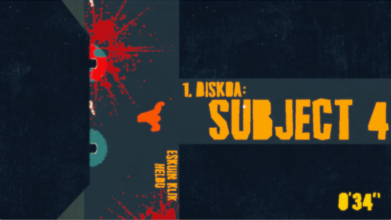

# TXIMINOA ESKAPO. Ape Out euskaraz

Zenbat pelikula / telesailetan ikusi ditugu tximinoak laborategietan preso, beraiekin esperimentuak edo dena delakoak egiteko? Batzuetan tximino horiek protagonistarekin goxo eta lagunkoi, betirako adiskidetasun eder batean bukatuko den istorio bat aurkezten digute. Baina, bertze batzuetan, animalia haserre dago eta nola edo hala alde egin nahi du preso duten lekutik, parean jartzen zaion guztia deuseztuz.

Gabe Cuzzillo, Matt Boch eta Bennett Foddyk 2019an ere gorila handi batekin egin zuten esperimentua, Ape Out jokoa bere horretan esperimentu bat dela erran daitekeelako. Kristalezko kaiola batean preso dagoen gorila bat kontrolatuz hasiko gara eta gure helburua leku horretatik alde egitea izanen da. Ihesean zu preso hartu zaituzten langileak agertuko dira, batzuk armarik gabe eta gehienak armekin (eskopetak, bonbak, su-jaurtigailuak...). Zure arma bakarra zure beso indartsuak dira. Beso indartsu horiek lanean jartzen dituzunean, musika gero eta potenteagoak lagunduta jokoak sekulako martxa frenetikoa hartuko du, heriotz zurrunbilo batean sartuz.

Nahiz eta testu kopuru handirik ez duen, euskaraz aritzeko aukera dugu hemendik aurrera.

## Jazz erritmoan

Ape Out musikarekin hagitz lotuta dago: jazz musika, ihes desberdinak albumetan banatuak, ihes bakoitzeko maila diskoko abesti bat da... Garapen garaian, garatzailea nahiko obsesionatuta omen zebilen Pharoah Sanders-en "You've got to have freedom" abestiarekin eta honek transmititzen ziona jokoaren bidez helarazi nahi izan omen digu. Nahiz eta musikazalea naizen, jazzari inoiz ez diot aukerarik eman, dezenteko nagia eman izan dit, egia erran. Jokoan aitzinera egin ahala, nagi hori gero eta ttikiagoa da, ea oraindik jazzale amorratuan bihurtuko naizen... Dena dela, eskerrik asko Pharoah eta Gabe.

https://youtu.be/TFUDrK9GLaQ

Joko honen berezitasun handietako bat, soinuaren dinamikotasuna da, egoerari egokitzen baitzaio. Gorilak ematen duen kolpe bakoitza perkusio baten kolpe moduan entzunen dugu, aurrera egin ahala soinu-banda guk sortuko dugularik. Soinu banda guk sortzen dugun moduan, pantaila koloreztatu ere eginen dugu, gure aurkarien odolarekin. Jazzarekin hain lotua dagoen inprobisazioa ez dugu soinuarekin bakarrik lortuko, koloreetan ere transformatzen da. Nahiz eta soinu eta koloreak partida bakoitzean eta jokalari bakoitzaren araberakoa izan, kontraste handiko margolanak eta musika zoragarriak sortzen dira, beti. Jokaldia eten eta begira gelditzeko modukoak. Zentzu honetan, nabaria da Devolver Digital-en eskutik datorkigula, horrelako proposamen originalak ekartzen bereziki abilak baita.

## Itzulpenean arazoak

Erran bezala, jokoan ez dago testu gehiegirik (gehienak abestien izenak), ez dakit horregatik den edo dauden kontzeptuen sakontasunagatik, baina buelta dezente eman diot itzulitako hit(z) bakoitzari. Abestien izenak, jostatzen hasi baino lehen horixe zirela uste nuen, izen soilak. Baina jostatzean eta batez ere, itzultzen hastean, sakontasun handia ikusi diet. Izen horiek mailan gertatuko denarekin zerikusia dute (eszenatokiarekin, agertuko diren arma berriekin), musikako kontzeptuekin eta baita ingelesezko adierazpenekin ere. Harritu egin nau zeinen zaindu eta ongi aukeratuak dauden izen horiek. Horrela izanda, itzulpena egiterakoak nahiko buruhauste eman dizkit. Berezkoaren fideltasuna mantendu nahi nuen, baina lokalizatu ere egin nahi nuen, gure adierazpenak, edo musikari erreferentzia eginez. Batzutan hitzaren itzulpena hiztegitik zuzenean hartu dut, baina bertze batzuetan interpretazio pertsonal librea erabili dut.

Lehenengo kasuaren adibideetako bat, "long shadows" mailaren izena "itzal luzeak" itzuli dudala da. Bigarrenaren adibidea, egin dudan interpretaziorik handiena, "incoming" maila "zalaparta" bezala itzuli dudala da. Bertze hizkuntzetarako itzulpenak ikusi, mailan zehar "incoming" horrek erran nahi duena ulertu (uste dut) eta nere esperientziatik ekarritako abesti izena da "zalaparta", ea norbaitek ikusten duen jatorria.

Modu honetan, euskal abesti edo taldeei erreferentzi batzuk egin dizkiet. Eta hementxe utziko dut itzulpena, izan ere, ziur nago oraindik ez banu zabalduko gero eta buelta gehiago emanen nizkiokela eta ez nukela inoiz bukatutzat emanen itzulpena.

[Hemen daude](readme.md) jokoaren testuen fitxategia partxeatzeko jarraitu beharrezko pausuak.

Eta gogoratu, maskotarik baldin baduzu (kaiolan izan edo ez), zaindu eta maitatu, inoiz ez baitakizu noiz hasiko den ihes egiteko bide bila.