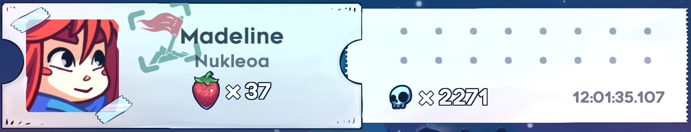
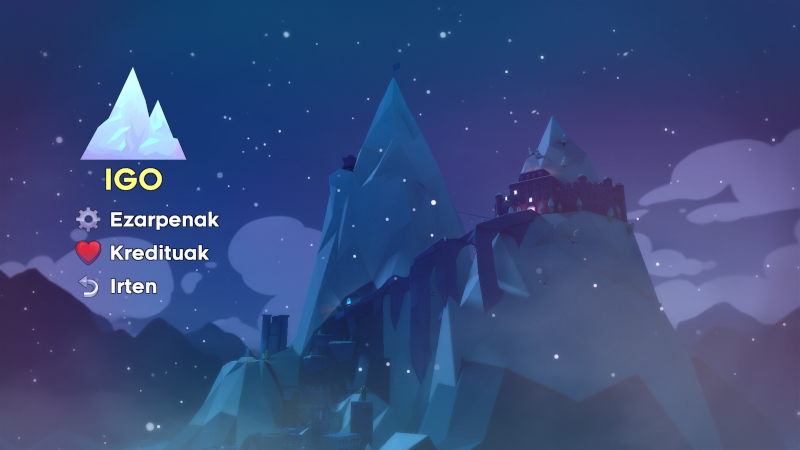

# Mendi Zerutiarra: Celeste-ren igoeraz euskaraz goza ezazu!

Nahiz eta jokoa 2018an kaleratu, orain ezagutzen dugun Celeste joko txiki bat bezala jaio zen. Garai hartan PICO-8 kontsola birtuala puri-purian zegoen. Ez dakienarentzat, PICO-8 fisikoki exisitzen ez den kontsola bat da eta bere ezaugarri nagusia hau da: espezifikazio hagitz mugatuak dituela. Kontsolan bertan daude musika, kodea... egiteko tresnak.

Garatzaile anitzentzat erronka izan zen, kontsola horren mugen barrenean ahalik eta joko txukunenak egitea. Gero joko horiek PNG fitxategietan banatzen dira, karatularen irudian bertan daude jokoak txertatuta. Zoragarria.

PICO-8 sukar horretan, hainbat jokok izan zuten sona, baina nik batez ere oroitzen dudana Celeste da. Eta nere belarrietara ailegatu zenerako, arrakasta handia lortua zuen seinale. Horrelakoetan gertatzen den moduan, arrakasta horrek joko oso baterako materiala zutela erakutsi zien garatzaileei eta horretan jarri ziren. PICO-8ren mugak alde batera zituzten noraino ailegatuko zitezkeen erakusteko.

## Joko zaila da?

Beti aditu izan dut joko zaila dela eta ni nahiko zarpaila bainaiz, ez nintzen orain dela gutxira arte animatu. Nork ez ditu ikusi Super Meat Boy-eko ezinezko pantailak ikusi? Ba Celesterekin ere gauza bertsua gertatu zitzaidan, bideoren bat ikusi nuen eta zer nolako salto, bulkada... nik egiteko ezinezkoa zela pentsatu nuen.

https://www.youtube.com/watch?v=5NVOk7Q4G8k

Baina behin instalatu eta euskaratzeko zeinen erreza zen ikusita, aukera bat ematea pentsatu nuen. Tira, jokoa, erraz-erraza... ez da. Kontua da, joko honetan jokalariaren garapena eta pantailen zailtasuna izugarri ongi orekatuta daudela. Jokoan nola aritu eta pantaila zail horiek nola gainditu ikasten ari zarela nabari duzu. Jokalariaren garapena sentitu egiten da.

Hori bai, nere kasuan, 2271 aldiz hil behar izan nuen jokoaren oinarrizko zatia bukatzeko. Horrek dakarren frustrazio eta gozatzearekin. Gainera, une batzuetan lehendik ikusi nituen bideoetako erokeriak egiteko gai nintzela ikusi nuen. Zeinen ongi neurtuta dagoen zailtasuna eta zeinen ongi diseinatu dituzten mailak.

## Itzulpena

Euskal Herrian mendigoizale batzuk badaude, ez? Altxa dezatela eskua... ba, gutxi batzuk. Ba euskaraz eskalatzeko eskuartean magnesioa izan beharrean, oraingoan aginte batekin nahikoa izanen dugu, Celesten euskaraz jostatzen ahal baikara. Jokoa euskaratzeko jarraitu beharreko pausuak [hemen](./readme.md) daude. Animatuko zarete IGOtzen?

Oraingo itzulpen honetan, berez ez zegoen konplikazio handirik, beraz, neronek sortu nuen. Jokoko pertsonaia bat, emakume zahar bat, gainontzekoekin hika aritzea polita litzatekela pentsatu nuen. Hika, eta gehienetan jokoko protagonistarekin aritzen baita, neska bati hika.

Nik hika egin izan dudan gutxia, mutilekin egin dut. Neskekin deus ere. Ze nezesidade orduan? Ba hori, polita izaten ahal zela iduritu zitzaidan. Beti bezala, probatu eta edozein akats edo hobekuntza ikusten baduzue, erran, faborez.

## Galderarik?

Aurkezpena bukatu da eta publikoko pertsona batek galdera bat du: Aizu, Josu, garatzaile kanadiarrek egindako mendira igotzeko jokoekin fijazioren bat duzu?