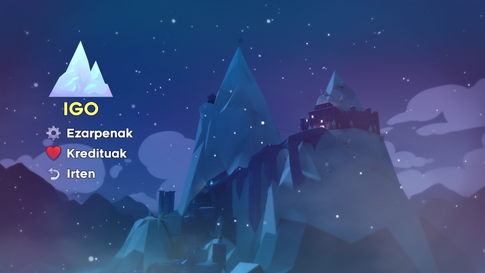

# CELESTE euskaraz

Ondorengo fitxategiak kopiatu:

* `euskara.png` fitxategia jokoaren instalazio direktorioan dagoen `/Content/Dialog/Icons` direktorio barruan.
* `euskara.txt` fitxategia jokoaren instalazio direktorioan dagoen `/Content/Dialog/` direktorio barruan.

Fitxategia ongi kopiatu bada, jokoan hizkuntza aldatzeko aukeren artean agertuko da Euskara

