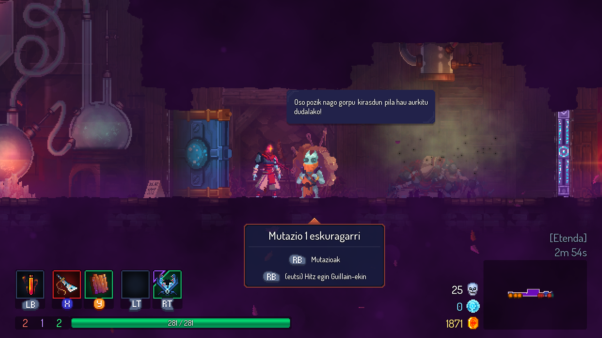
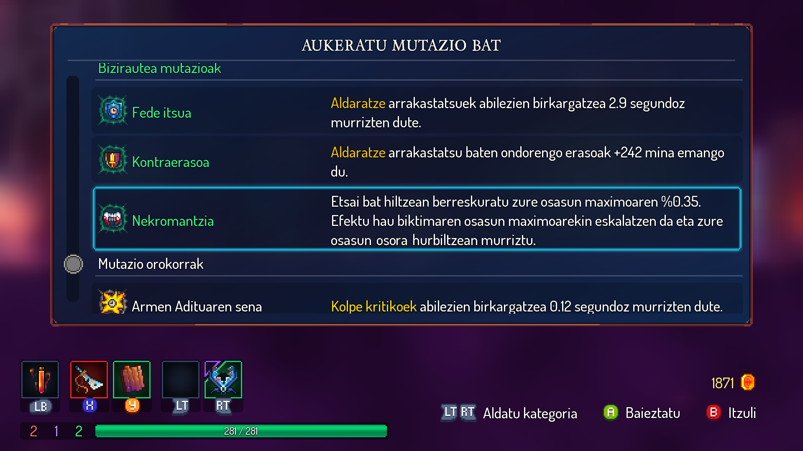

# Hildako Zelulak (Dead Cells euskaraz)

Aspalditik nuen Dead Cells fitxatua (Motion Twin, 2018), bere estetika pixelatuak, mugimendu azkarrak eta pantailan ia kabitzen ez ziren partikula kopuru izugarriak erakartzen ninduten. Baina bazegoen nire bertze zati bat, probatzeak nagia ematen ziona: zailtasuna, hiltzean berriz hasi behar izatea, mailen ausazkotasunak ere ez ninduen erabat konbentzitzen... Eta merkatuan dauden joko pila egonda, nagiak irabazten zuen beti.

Baina orduan, joko, genero edo erronka berriak probatzera bultzatzen gaituzten figura hori agertu zen: lagunak. Interneten irakurritako testuek edo ikusitako bideo guztiek baino barrenago ukitzen zaituzten elkarrizketa sakon horiek: "Joko hau la hos*** da!". Erretorika horrekin, ez zait probatzea bertze aukerarik gelditzen, konbentzitu nauzue.

Onartu beharra dut erabaki ona izan zela. Nagia ematen zidaten zailtasun eta kontu horiek hor zeuden, bai. Baina partida motzak dira eta hil orduko berriz hasteko gogoa ematen du. Badakizulako hurrengoan pixko bat urrunago aileagatu ahal izanen zarela (edo ez). Lortutako armekin eta abileziekin aurrerapena argia da, nola hobetzen ari zaren nabaritzen ahal duzu, beti ere erronka maila altu mantenduz. Eta mailen ausazkotasuna espero nuena baino hagitzez gehiago gustatu zait, hori ere ongi neurtutako ausazkotasuna baita. Nahiz eta bidea desberdina izan, badakizu nora aldera joatea komeni zaizun. Behin eta berriz pantaila berdinean (ez pantaila berean!) ibilita ere, beti da berria eta ez dago aspertzeko aukerarik!

Onartzen dut, engantxatua egon nintzen denboraldi luze batez udan zehar. Adrenalinaz goitino zaudelarik, ziztu bizian lasterka, parean jartzen zaizkizun munstro horiek sastakatuz... sentsazio zoragarria da! Hiltzen zaituzten arte. Adio abiadura eta emozioa. Kaixo haserre eta maldizioak. Zenbat aldiz egin ote dut aulkitik/sofatik salto nire pertsonaia erortzen eta hartuta nituen zelulak hegan ikusi ditudanean!

Aritu ahala, horrelako harribitxiak euskaraz egon behar lukeela pentsatu nuen eta hori nola egin pentsatzen hasi nintzen...

## Itzulpenean aurkitutako oztopoak

Jokoa deskargatu orduko hartua dudan ohitura bat dut (ona edo txarra? Ez dakit...): Itzultzeko moduko fitxategiren bat badago? Jokoaren dendaren webgunean badago itzultzeko tutorialen bat? Eta kasu honetan, bi galdera horien erantzuna baiezkoa zen.

Steam-en garatzaileek beraiek jarritako albisteetako batean tutorial bat dago, jokoarekin batera pasatzen dituzten POT fitxategiak oinarri hartuta itzulpena nola sortu behar den azalduz. Gainera, gero itzulpen hori Steam Workshop-era MOD moduan nola igo behar zen ere azaltzen da.

Itzuli beharreko testu guztian hain eskura izatea zoragarria da, fitxategia ireki eta itzultzen hasi. Uda baino lehenagotik itzuli nuen joko osoa eta jokoan ari nintzen bitartean zuzeneketak egiten... Itzulpena publikatzeko garaia ailegatu zela erabaki nuen orduan.

Ba itzulpena egiteko eta zabaltzeko modua egina dago. Bikain, ez? EZ? Ba ez!

Zein da arazoa? Tutorial horretan mod-ak zabaltzeko azaltzen duten modu bakarra Steam Workshop-en publikatzea dela. Kontua da joko hau GOGen ere saltzen dela eta internet-en bila eta bila ibilita, ez dut ikusi GOG-n erositako Dead Cells-i mod-ak instalatzeko modurik ikusi. Beraz, itzulpen mod-a ere ezin izanen litzateke GOG bertsioarekin erabili.

Garapenerako erabili zuten heaps.io motorea ezaguna dut, nik ere egin baititut nere kontutxoak horrekin. Horregatik animatu nintzen datuak (baita itzulpenak ere) gordetzen dituzten res.pak fitxategiaren egitura ezagutu eta hor esku sartzera. Modu honetan, zuzenean fitxategi horretan nire itzulpena sartu ahalko nuke eta horrela, Steam edo GOG-n erositako jokoan itzulpena sartuko nuke. Eta ikerketa horren bideaz dexente disfrutatuta, azkenean lortu nuen!

Beti bezala, instalatziale batekin aplikatuko da itzulpena. [Hemen daude](readme.md) itzulpena instalatzeko jarraitu beharrezko pausuak.

## DLC guztiak euskaratuta

Lehen aipatutako POT fitxategi horietan sorpresa bat topatu nuen, izan ere, atera dituzten DLC guztien (Erregina eta Itsasoa, Hazi Txarra, Erroketa Hilkorrak eta Castlevaniara itzulera) testuak bertan zeuden. DLC horiek gabe ere jokoak baditu sekretu, elkarrizketa eta ibilbide piloa eta ezin izan dut dena ikusi, inondik inora ere. Beraz, DLC edo gabe, itzulpenarekin animatzen bazarete eta okerren bat ikusten baduzue, abisatu inongo lotsarik gabe!
