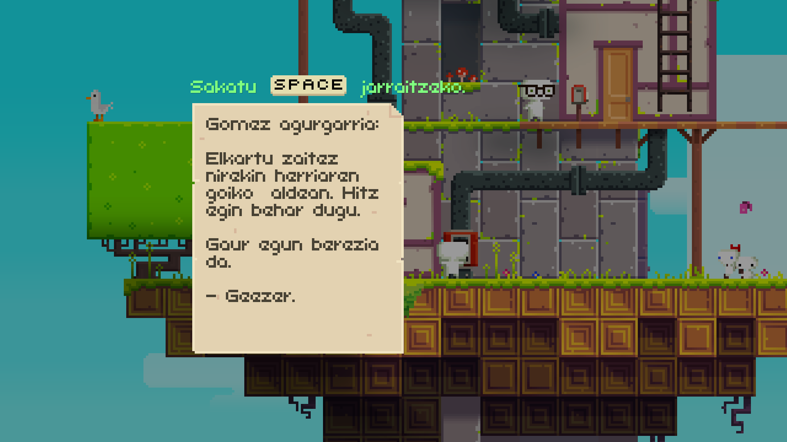
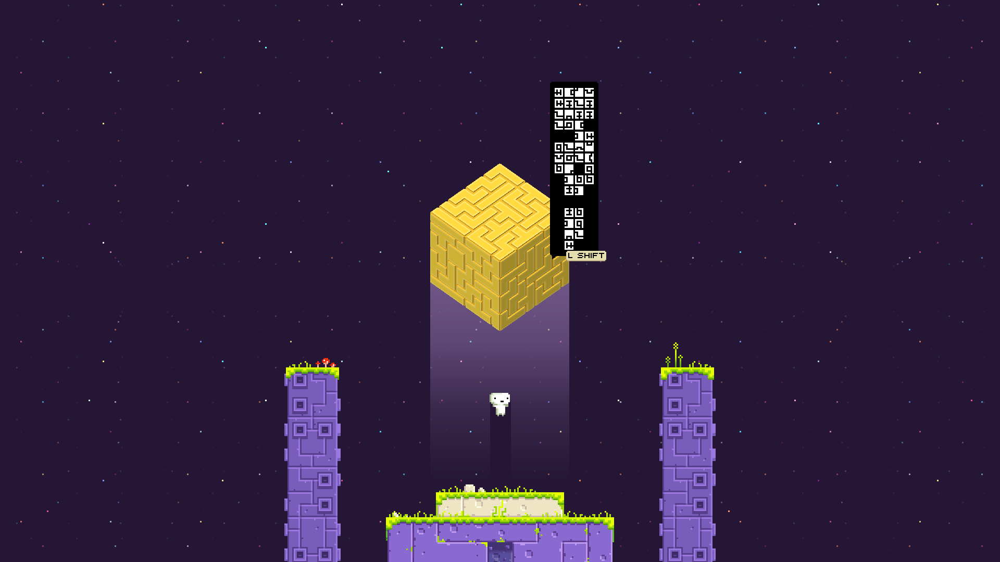
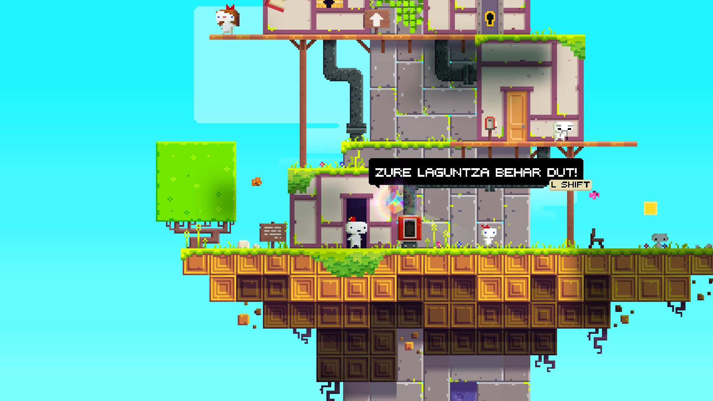

# Zatozte FEZtara!

Kuadrilako merienda batean (haurrak ditugunetik, planen ordutegia erabat aldatu zaigu) bideojoko indie-n eztandaren hasieraz ari ginela, betikoak atera ziren: Super Meat Boy, Braid, FEZ... Eta ohartu nintzen ez nuela horietako bakar bat ere probatua. Eta klasikoak diren heinean, jokatu beharrekoak izanen dira, ezta?

Hauek nire (aurre)iritziak:

- Super Meat Boy: Ez nau batere tentatzen, ikuste hutsarekin estresatu egiten naiz.
- Braid: Itxura ederra du, denboran aitzinera-gibelera ibiltzea beti da ona, euskaraz dago... Baina Jonathan Blow ez dut gehiegi atsegin.
- FEZ: Itxura aldetik zoragarria iduritzen zait eta institutu garaiko marrazketa teknikoa ekartzen dit gogora. Eta hori, nere kasuan behinik behin, gauza positiboa da.

Ederki, erabakita zeinetan arituko naizen. Xehetasun ñimiño bat: ez dago euskaraz. Ba benga, ikerketa azkar baten ondotik, horretarako tresnak badaudela topatu nuen (komunitate haaaaundia du). Eta bideojokoarekin jostagarritasunarekin hasi baino lehen, honen itzulpenarekin hasi nintzen. Ez zegoen testu kopuru izugarria ere eta itzuli orduko hasi nintzen jokoan. Menua eta elkarrizketak euskaraz, inongo arazorik gabe, a ze zortea nirea! (spoiler: EZ)

## ZU herriaren errunak (A.K.A. izandako arazoak)

Jokoan aritu ahala, nabaria da izugarri sekretu pila daudela. Sekretu guztiak ez dira FEZ joko bakarrean sartzen %100ean, ezta %200ean ere. Imajinatu zenbaterainoko sekretu eta enigma pila dauden, denak osatzeko jokoaren %209.4 pasatu beharra dagoela!

Eta sekretu horietako dezente argitu ahal izateko argibideak paretetan marraztuta dauden errunen bidez ematen dizkigute. Eta ez dira letra arruntak, (jokoan zehar ezagutuko digutun) ZU herriatarren alfabetoa da interpretatzen ikasi behar duguna. Erruna horietan ageri diren esaldiak ez dira jokoan hasi baino lehenago itzuli nituen fitxategietan ageri. Esaldi horiek irudiak dira: eraikinetan integratuak, neoizko argi formekin... ezin izan nituen jokoaren fitxategien artean non zeuden aurkitu ere... Beraz, erruna bakoitzari dagokion letra zein den asmatzen badugu, ingelesezko testu bat irakurriko dugu.

Eta hor dago ebazten asmatu ez dudan bertze arazoa, lokalizazio arazoa oraingoan. Izan ere, errunei dagozkien letrak ezagutu ahal izateko, erreferentzia anglo-saxoi bat ulertu behar dugu. Jokoan ageri den eszena bat ezagutu eta paretako erruna-esaldi batekin parekatu beharko da. Korapilatsuegia niretzat.

## Itzulpena

Saiatu naiz, eh, baina ezin izan dut horien aurka... hala ere... ze demontre! Egindako itzulpenak jokoa pasatzeko balio izan badit, zergatik ez zabaldu? Hori bai, norbait itzulpen hau osatzeko gai bada, izugarri eskertuko nuke laguntza!

[Hemen daude](readme.md) jokoan euskaraz aritu ahal izateko jarraitu beharrezko pausuak.