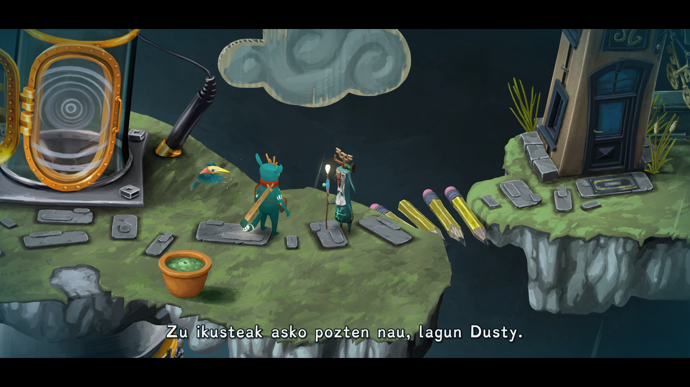
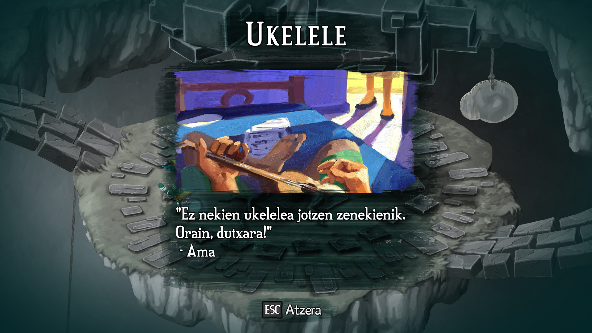
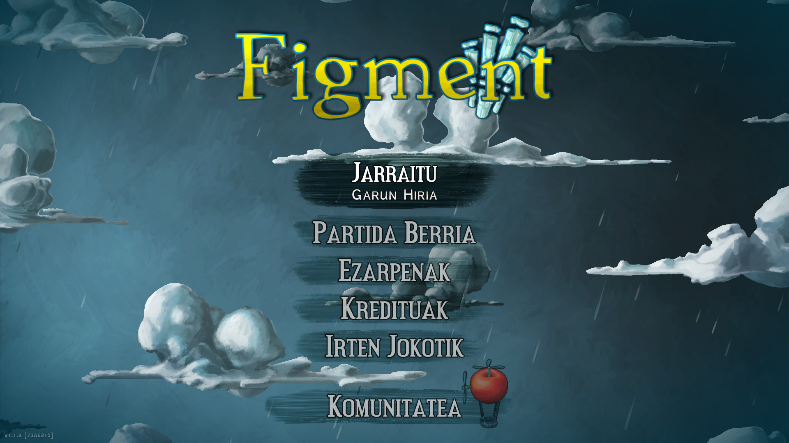

# Figment-en mundu surrealista euskaraz

Guraso eta haur baten arteko elkarrizketa bat entzunez hasiko dugu jokoa. Entzun erran dut, izan ere, ikusi, ez baitugu gauza handirik ikusiko. Elkarrizketaren bukaerak markatuko du gero ikusten hasiko garena. Nahiz eta hasieran ez dugun lotura handirik nabarituko entzudakoaren eta ikusten ari garenaren artean, poliki-poliki joanen gara ulertzen.

Dusty izeneko pertsonaia berezi bat mugitzen hasiko gara eta bisitan etorriko zaigun Piper txoria izanen dugu bidelagun. Hasierako animazioaren ondotik, berehala ezagutuko dugu jokoaren mekanika.

Jokatzeko eran akziozko abentura klasiko bat da Figment. Baina jokatzeko modu horri eman dioten itxura ez da hain klasikoa. Eskuz marraztu eta margotutako mundu erabat surrealista eta koloretsu batean murgilduko gara, betiere musika eta umorea presente daudelarik.

https://www.youtube.com/watch?v=4yIIbH0SEmw

Eskuz egindako (bai, berriz azpimarratu nahi nuen) mundu zoragarriak esploratu beharko ditugu istorioa kontatzeko dauden kapa desberdinak aurkitu ahal izateko. Gure eguneroko objektuen ikuspegi desberdinak agertuko zaizkigu: liburu erraldoi hegalariak, arkatz-eskailerak, teontzi-etxeak... Pertsona baten gogoaren barruan murgilduko gara eta bertako oroitzapen, arazo eta beldurrei egin beharko diegu aurre.

Uhartez uharte mugituko gara pertsona baten gogoaren txoko desberdinak ezagutzen. Txoko horietan, pertsona horren sentimenduen etxeak ikusiko ditugu. Pertsona horrek dituen oroitzapen eta bizipenekin zerikusia duten ingurune eta objektuak deskubritzen joanen gara. Pertsonaia xarmagarri batzuk ezagutuko ditugu, baita beldurgarri batzuk ere. Eta ikusiko ez ditugun izaki anitzekin izanen dugu solas egiteko aukera, beraien etxeetako ateak joaz.

## Musikaren garrantzia

Musika joko gehienetan garrantzitsua bada ere, Figment-en are garrantzi handiago du. Izan ere, entzuten ari garen musikaren erritmora mugitzen diren elementuz betea dago ingurunea, tronpeta-landareak, akordeoi-zubia... Aurkitzen dugun gaizto nagusi bakoitzak bere abestia kantatuko du letra maltzurrekin, jokalarion animoa xahutzeko asmoz. Akziozko abentura jokoetan hain ohikoak diren puzzleetako batzuk ere puzzle musikalak dira.

Puzzleak aipatuta, ez dira bereziki zailak, baina batzuk denbora pixko bat behar dute ulertu eta osatu ahal izateko.

## Oroimintzak

Jokoaren helburu nagusia lapurtu diguten album bat berreskuratzea da. Helburu horri jarraituz, marka berezi bat duten harri batzuk ere ikusiko ditugu. Harri horiei kasurik egin gabe buka dezakegu jokoa inongo arazorik gabe, baainaa...

Kontua da, harri horiek zerbait adierazi nahi digutela: gogo honetako Oroimintzak hurbil ditugu. Gogoaren jabea den pertsonaren iragana eta historia berreskuratu ahal izanen ditugu oroimintz horiek hartuta, jokoaren testuingurua osatuz. Bildutako oroimintz guztiak Garun Hiriko zuhaitz batean geldituko dira, frutak bailiran. Modu horretan, berreskuratutako historiaren oroitzapen guztiak leku bakarrean izanen ditugu eskuragarri.

## Haurrekin aritzeko

Ez naiz aspertuko itxura aldetik zeinen polita eta atsegina den erraten. Baliteke horregatik bakarrik haurrentzako egokia dela pentsatzea. Puzzleak ere ez dira batere zailak eta logika pixka bat aplikatuta erraz ebazteko modukoak dira. Baina, kontatzen duena zertxobait sakonagoa da eta hori ulertzea beharbada zailtxoa izaten ahal da. Eta hor helduon laguntza beharko dutela uste dut.

Beraz, haurrak aritzeko modukoa dela erranen nuke? Bai, zalantzarik gabe, ez baitako gore momenturik (zuri begira ari naiz, Postal), ezta hiztegi gogorregirik ere (oraindik ere zuri begira, Postal). Baina haurraren adinaren arabera, inguruneko edo istorioaren xehetasunak helduren batek azaltzea izanen litzateke hoberena.

## Itzulpena

_Cerebrum City_, _Cité Cérébrale_ edo _Cerebrópolis_ bisitatu beharrean _Garun Hiria_ bisitatu nahi duzu? _Remembrane_-ak beharrean _Oroimintzak_ hartu nahi dituzu? [Hemen](./readme.md) dituzu jokoa euskaratzeko jarraitu beharreko pausuak.

Beti bezala, probatu eta edozein akats edo hobekuntza ikusten baduzue, erran, faborez.

Ah, eta ez ahaztu bolumena jartzea!!
