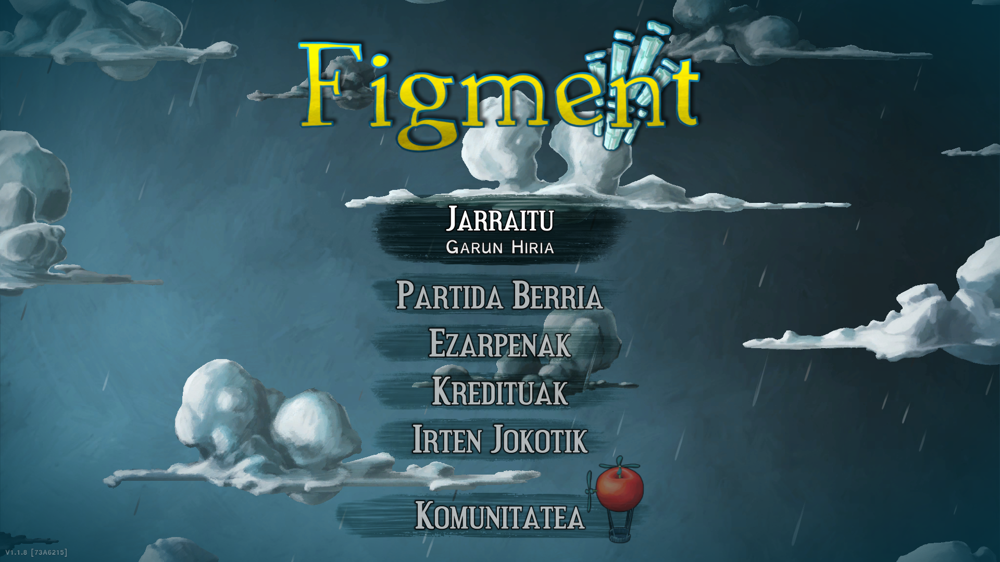

# FIGMENT euskaraz

Dagokizun sistema eragileran exekutagarria deskargatu:

* [Linux](./instalatzailea/figment_euskaraz_linux), [Windows](./instalatzailea/figment_euskaraz.exe) edo MacOS ([M1](./instalatzailea/figment_euskaraz_macos_m1) eta [gainontzekoak](./instalatzailea/figment_euskaraz_macos))
* Exekutatu eta jokoaren instalazio direktorioa bilatuko du.
  * Aurkitzen badu, bertan instalatzeko proposatuko dizu.
  * Ez badu aurkitzen, zuk bilatzeko eskatuko dizu.
* Jokoa non instalatuta dagoen dakienean, programak itzulpena instalatuko du.

Instalazioa ongi joan bada, jokoan hizkuntza aldatzeko aukeren artean agertuko da Euskara.

