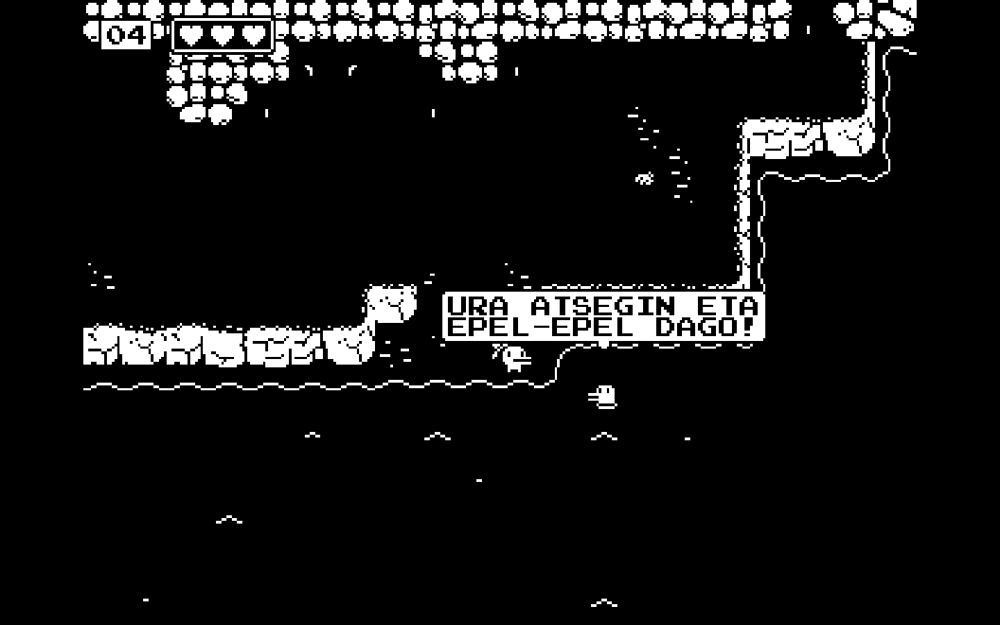
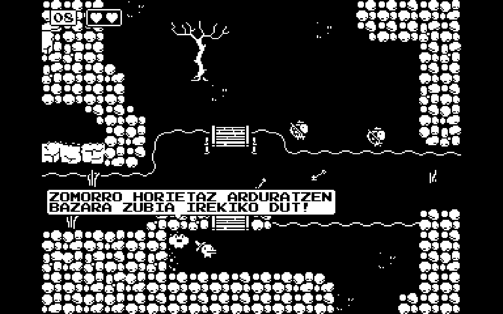

# MINIT

Kopia ezazu `minit_loc.csv` fitxategia jokuaren instalazio direktorioan dagoen `assets` barruan. Lehendik dagoena gainidatzi beharko duzu.

Mac ordenagailuetan:
* Exekutagarriaren gainean eskuineko botoia klikatu
* "Paketearen edukia erakutsi" sakatu
* "Contents/Resources" directorioan itsatsi `minit_loc.csv`

Fitxategia ongi kopiatu bada, jokoan hizkuntza aldatzeko aukeren artean agertuko da Euskara

Oharra: Jokoak dakartzan hizkuntzetatik polonieraren ordez jarri dut euskara, ezin baitzen bertzerik gabe hizkuntza berri bat gehitu.

