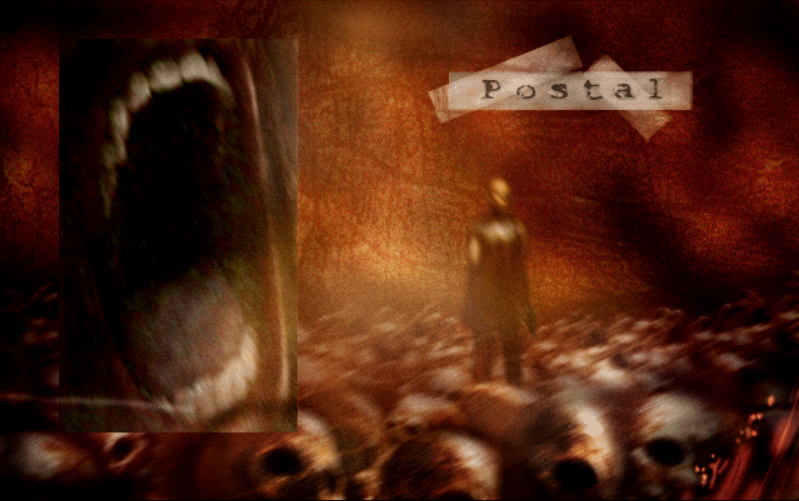

# Postal-en mundu eroan eta lotsagabean sartu berriro... baina euskaraz ezagutu oraingoan!

2000ko hamarkadaren hasieran nire ordenagailuan izugarrizko joku pila instalatzen nituela oroitzen dut: lagunen bidez, e-mule, torrent, patch, crack, serial zenbakiak, CD-MIXak (hauek aparteko artikulu bat merezi dute)... bai, pirata hutsak ginen garai hartan.

Iturri pila horretako ez dakit zeinetatik ailegatu zitzaidan joku desberdin, gordin eta lotsagabe bat: Postal.

Gaur egun jokoaren izaera aski ezaguna dugu baina garai hartan, izen horrekin, "Paperboy" bat ere espero izaten ahal zen, ejem. Jokoa martxan jarri arte.

Oihuka ari den aho handia eta kaskezur itsaso batean zutik dagoen pertsona bat. Irudiak bakarrik ez badu nahiko ezinegon sortzen, soinuak lortuko du, soinua ere irudiaren atmosfera maltzur horretan baitago. Ez dut uste bizikleta gainean egunkariak banatzea tokatuko zaigunik...

Jokoaren menua gibelean utzi eta jokoan bertan hasterakoan, ingelesezko testu bat agertzen da (maila bakoitza gainditzean berri bat agertuko da) eta metraileta haundi bat duen pertsona bat mugituko dugu, "Postal Dude" izenez ezaguna dena. Helburua? Paretik pasatzen den edozein hiltzea, honek armarik izan edo ez, badaezpada.

Hasi orduko hartzen du martxa jokoak, tutorial edo egokitze handirik gabe: oihuak, leherketak, tiroak, exekuzioak, errukitzeko eskaerak, gure pertsonaiaren harrokeria hitzak... Postalen munduan erabat barneratzeko balio dute.

Ordutik maitasun bereziarekin gogoratzen dut jokoa, nahiz eta orduan gehiena ez ulertu: audioak, eta, batez ere, pantaila arteko idatziak. Eta horren pena izan dut. Gaur egun ingelesa gehixeago menperatzen dudanez, itzulpena egiten hasi nintzen. Hainbertze jende hiltzeko zein arrazoi ote dugun jakin eta ulertu nahi nuen (spoiler: hitzak ulertuta ere, motibazioa ez dut argi)

Eta nire nerabezaroan bizitakoari omenaldia egiteko modu egokia izan da, sarreran aipatutako partxe horietako bat neronek egin baitut!

## Itzulpen prozesua

Lehendik itzulitako Nuclear Blaze eta A short hike seme-alabetan pentsatuz egin nituen. Itzulpen hau orain dela 20 urte baino gehiagoko ni haretan pentsatuz egin dut.

Jokoan hiru testu mota bereizten dira: erabiltzailearentzako pantailako informazioa (ingelesezko HUD siglez ezaguna), mailen arteko testuak (gure pertsonaiaren egunerokoaren sarrerak) eta kredituak.

Azkenengo biek testu fitxategietatik irakutzen dira, beraz, horiek aldatzeak ez du misteriorik. Lehengoak, berriz, HUD delakoak, lan handiagoa behar izan du. Izan ere, testu guztiak jokoaren exekutagarriaren baitan (edo bytean, oh yeah) txertatuta daude.

Hirutan banatu ditudan testu guzti horiek ordezkatzeko programatxo bat prestatu nuen. GNU/Linux eta Windowserako exekutagarri bana, [hemen instalaziorako azalpenak](./readme.md). Edozein zalantza edo arazo izanez gero, galdetu lasai, denon artean eginen baititugu itzulpen hoberenak.