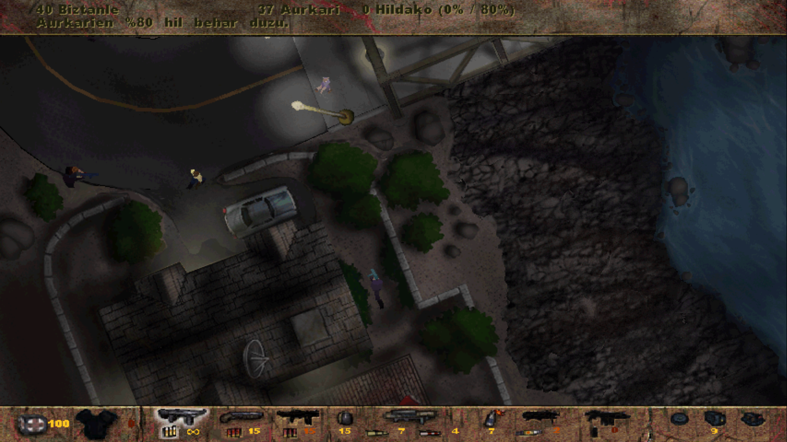

# POSTAL

Dagokion sistema eragileran exekutagarria deskargatu:

* [Linux](./partxea/patch_postal_linux) edo [Windows](./partxea/patch_postal.exe)
* Deskargatu berri duzun partxea jokoa martxan jartzeko exekutagarria (Linuxen `postal1` eta Windowsen `Postal.exe` edo `Postal Plus.exe`) dagoen direktorio berean jarri
* Partxea exekutatu: honela, partxeak jokoaren exekutagarri barruko testuak aldatuko ditu. Badaezpada, komeni da komando lerrotik exekutatzea, arazorik baldin badago, ikusi ahal izateko.

Gerta daiteke testu batzuk arraro samar ikustea. Jokoaren exekutagarriaren byte-ak ordezkatzen ditut eta exekutagarria bera ez hondatzeko, aldatutako hitzek berezko hitzen luzera bera izan behar zuten. Adibidez:

* easy -> erraz / GAIZKI
* easy -> aise / ONGI

Ez dut lortzen testu batzuk itzultzea:

* Zailtasunaren konfigurazioan: Medium
* Teklatuaren konfigurazioan: Walk, Strafe, Grenades...

Hitz hauek jostagarritasunean edo istorioaren garapenean ez dute eragin haundirik, beraz, bere horretan utzi ditut.



## GARAPENA ETA KONPILAZIOA

Partxea aplikatuko duen programa [V](https://vlang.io) lengoaian dago idatzita eta konpilatzerakoan, ordezkatu beharreko testu fitxategi guztiak exekutagarrian txertatuko dira. Exekutagarri eramangarri bakar bat lortuz.

```
v -prod postal_patch.v
```
