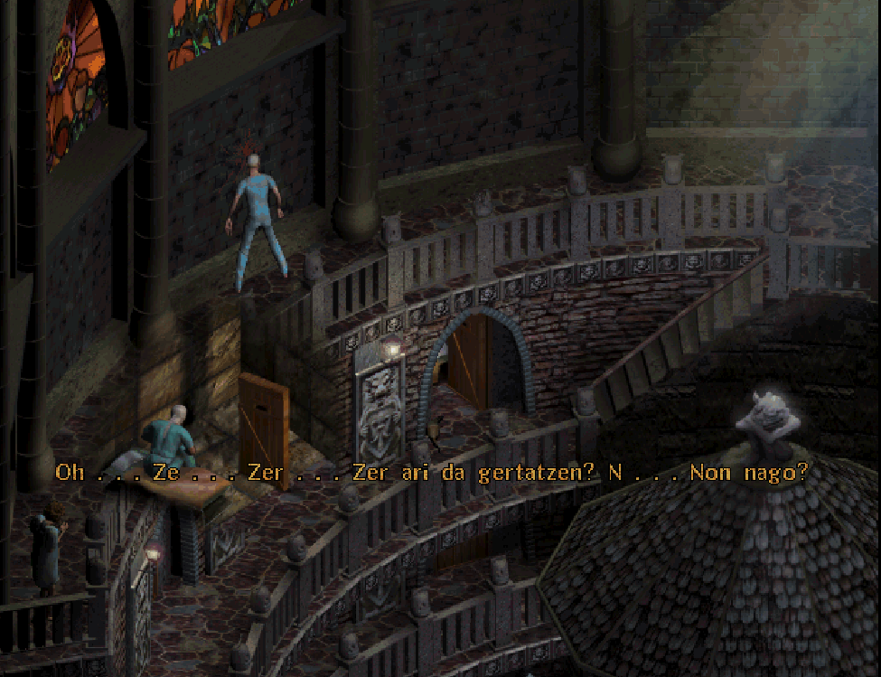

# SANITARIUM euskaraz

Beti gustatu izan zaizkit Point'n'click abenturak, nerabezaroan dexentetan aritu nintzen: Blade Runner, Day of the tentacle, Grim Fandango, Leisure Suit Larry, Versailles 1685... Horren jakitun, nire lehengusuak behin eta berriz gomendatu zidan Sanitarium izeneko joko bat, 1998an atera zen "beldur psikologikoa" etiketa duen joko bat. Garai hortan ingelesez bakarrik zegoen eta horregatik ez nintzen probatzera animatu, ez bainuen piperrik ere ulertuko. Interneteko leku ilun batetik gaztelerazko azpitituluak jartzeko aukera lortu nuenean, berriz, segituan joan nintzen jokoa probatzera.

Jokoa zinematika batekin hasten da: kotxea hartzera doan gizon bat, emazteari egindako dei bat off ahotsean aditzen dugularik.

"Maitea, ez duzu sinetsiko . . . Erantzuna aurkitu dut!! Urte guzti hauek . . . konturatu behar nuen! Baina gehiago dago . . . Etxera ailegatzean kontatuko dizut. Maite zaitut."

Eta "oh, sorpresa!": bidaia hori ez da etxean bukatuko. Dei horren ondotik, auto istripu bat eta pantaila beltza. Iluntasun hori bukatzean, irudian ikusten dugun moduan hasiko dugu jokoa, bista isometrikoan gela pila bat ikusten diren harrizko dorre batean, non gauden ere ez dakigula.

Hortik hasi beharko dugu misterioa argitzen, nor gara? Zein da "aurkitu dugun" erantzun hori? Zer da dorre hau eta zergatik dut aurpegia bendaz tapatua?

Bere garaian izugarri gustatu zitzaidan jokoa. Leku eta pertsonaia desberdinekin arituko gara: azteken garaiko jainko bat, neskatilatxo bat, intsektoideen aurka dabilen ziklope bat... Badirudi ez duela inongo lotura edo zentzurik, baina azkenean (edo behin bukatu eta gero berriz jokatuta) zentzua hartu eta leku guzti horiek zergatik bisitatuko ditugun ulertuko dugu.

Orain abentura eta desbentura guzti horiek, euskaraz bizitzeko aukera dugu, nire nerabezaroko joko kuttunetako bat den Sanitarium euskaratu baitut, eta berriz aritzeko aprobetxatu :-).

## Itzulpenaren zailtasunak

Itzulpenarekin hasi nintzenean, prozesuko zatirik zailena itzulitako testuak jokoak ulertuko zuen egitura batean antolatzea izanen zela uste nuen. [ScummVM](https://www.scummvm.org/)-k joko honentzat motorea duenez, bertako kodean begiratu ahal izan nuen zein zen beharrezko egitura, beraz, nahiko erraz gainditu nuen zailtasun hori.

ScummVM zer den ez badakizu: bere jatorria LucasArts-en SCUMM motorea erabiltzen zuten abentura grafikoak (Monkey Island saga, Indiana Jones...) jokatzeko motore libre bat egitea da. Baina gaur egun SCUMM motoretik hagitzez haratago joan da eta joko pila batentzako motorean garatu dituzte, eta jarraitzen dute. Ordenagailuetan, mugikor/tabletetan, kontsoletan... ia edozein gailutan erabil daiteke. Nik tableta zahar batean erabili dut Pajama Sam, Day Of The Tentacle, Monkey Island eta bertzeren batean aritzeko. Kontzeptua bera zoragarria da, baina teknikoki horrelako proiektu bat garatzen aritzea erokeria hutsa iduritzen zait. ScummVMk bere analisi propioa behar luke.

Motorearen tripak begiratzen ari nintzela konturatu nintzen jokuko une jakin batean, puzzle baten erantzuna hizkuntzaren araberakoa dela. Esaldi batzuetatik hitz bat erauzi beharreko puzzle bat da. Horretarako, letra batzuetan klik egin eta letra horiekin hitza osatu behar da. Kontua da, letra horiek kokalekua jokoaren motorearen bertan daudela txertaturik. Beraz, euskarazko puzzleak ongi funtzaionatu ahal izateko, motorea bera ikutu eta euskarazko testuan dauden letren posizioak sartu behar izan nituen. Software librearen bertze abantaila handietako bat, motorean aldaketa bat egin behar zela ikusi eta egin. Egin nuen ekarpen hori 2024/01/30-ean onartu zidaten ScummVMko repositorioan. Baina hobekuntza hori zuen aplikazioaren 2.9.0 bertsioa ez zen 2024/12/22-ra arte publikatuko. Ia 11 hilabete albiste hau idazteko gogoz.

## Jokoa erostearekin ez da aski

Motorean aldaketak egin ahal izate honek bere alde txarra ere badu. Izan ere, ScummVMren bertsio zaharragoetan ez baitugu puzzle hori euskaraz ongi egiteko aukerarik izanen. Gaur egungo makinetan Sanitarium martxan jartzeko ScummVM erabiltzen dute denda nagusiek. Eta jokoa GOG edo Steam-en erosten badugu, ScummVM bertsio zahar batekin dator (2.6.0 bertsioa hain zuzen ere). Jokoa osotasunean (ditxosozko puzzle hori eta guzti) euskaraz jostatzeko bidea pixko bat korapilatuz. Baina ez da zaila.

[Hemen daude](https://github.com/josuigoa/itzulpenak/sanitarium) jokoan euskaraz aritu ahal izateko eman beharreko pausuak.