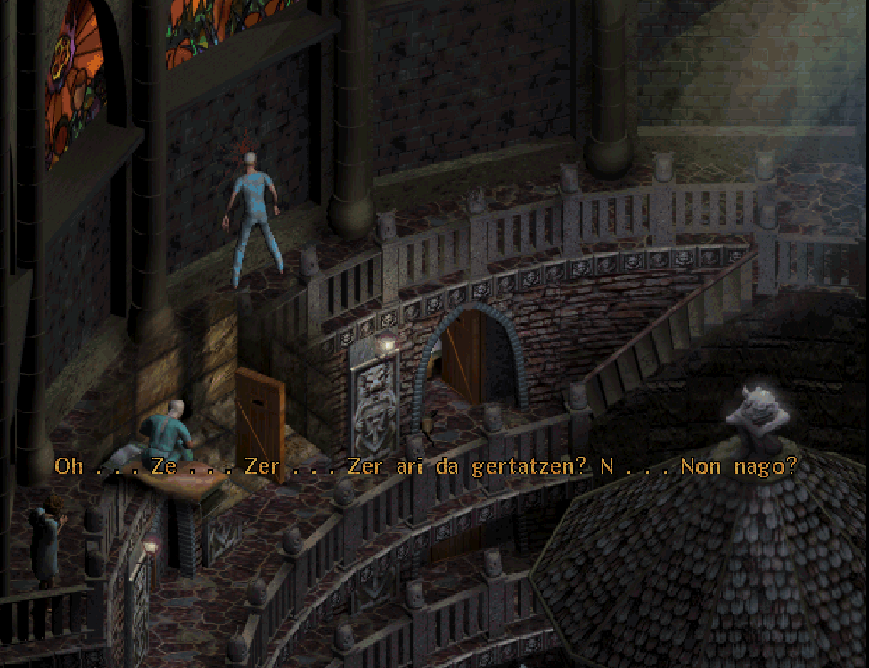

# SANITARIUM euskaraz

Dagokizun sistema eragileran exekutagarria deskargatu:

* [Linux](./instalatzailea/sanitarium_euskaraz_linux), [Windows](./instalatzailea/sanitarium_euskaraz.exe) edo MacOS ([M1](./instalatzailea/sanitarium_euskaraz_macos_m1) eta [gainontzekoak](./instalatzailea/sanitarium_euskaraz_macos))
* Exekutatu eta jokoaren instalazio direktorioa bilatuko du.
  * Aurkitzen badu, bertan instalatzeko proposatuko dizu.
  * Ez badu aurkitzen, zuk bilatzeko eskatuko dizu.
* Jokoa non instalatuta dagoen dakienean, programak itzulpena instalatuko du.

Jokoa martxan jarri eta menuko "Testu Ezarpenak" atalean azpitituluak aktibatu behar dira testuak pantailan ikusteko.

## ScummVM

Jokoa [ScummVM](https://scummvm.org/) bidez jartzen da martxan. Joko honek duen puzzle jakin bat euskaraz erabili ahal izateko ScummVM-ko motorean bertan aldaketan egin behar izan dira eta ScummVM-ren xxxx bertsioa baino berriagoetan bakarrik dago eskuragarri.

Jokoa Steam edo GOG bidez erosi baduzu, bertsio horietan ScummVM motorea jokoarekin dakar eta horrela exekutatzen da. ScummVM hori bertsio zaharra denez, ezin izanen da puzzle hori euskaraz ongi ikusi. Jokoa euskaraz erabili ahal izateko:

* Hasteko, jokoaren datuak euskaratzeko goian aipatzen den moduan egin, instalatzailearekin.
* ScummVM deskargatu, guttienez xxxx bertsioa
* Abiarazi eta eskuinean dagoen "Gehitu" botoia sakatu
* Sanitarium jokoaren fitxategiak bilatu. RES.000 fitxategia dagoen direktorioa aukeratu behar da.
* Jokoa ScummVMko jokoen zerrendan agertuko da, "Hasi" botoia sakatu.