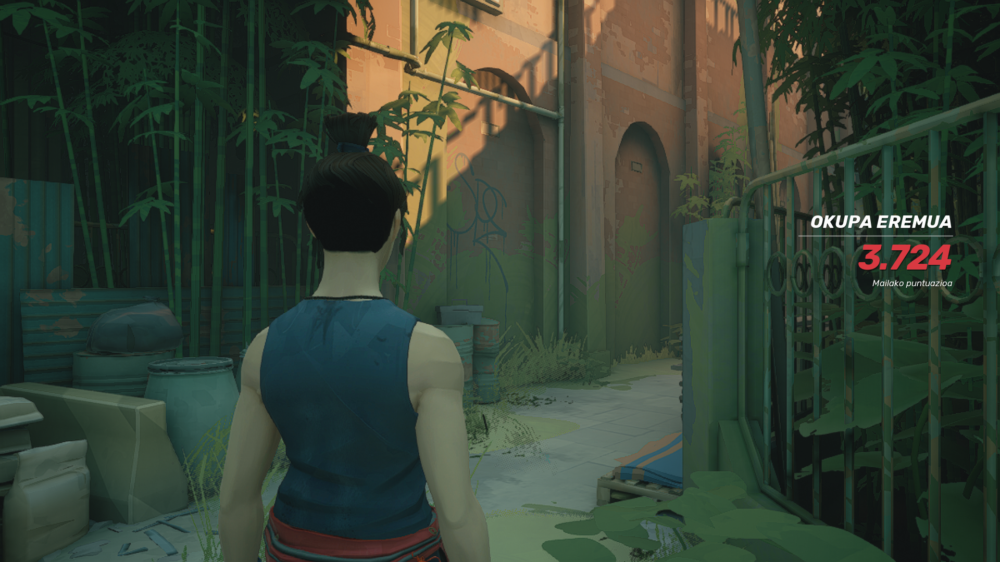
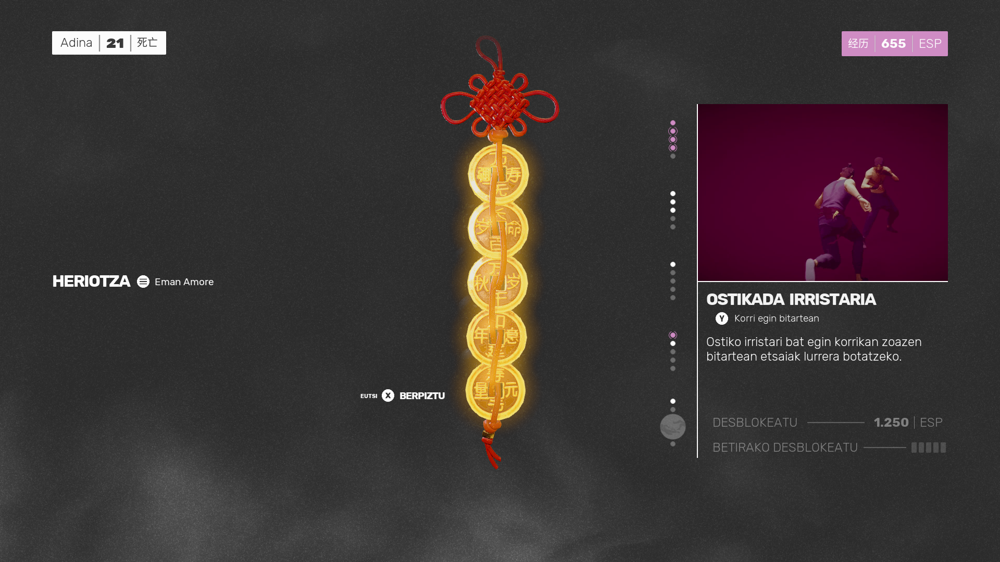
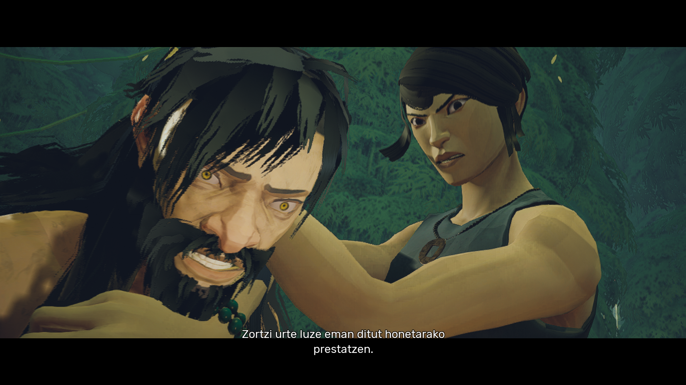

# Sifu euskaraz

Nire haur garaian, arte martzialen nahi adina pelikula genituen eta pantailan itsatsita egoten nintzen horiei begira, gure protagonistek ematen zituzten zapetekoekin harritua eta ukabilak airean mugituz, ni ere borrokan ari banintz bezala. Baina gehien gustatzen zitzaidana, ematen zituzten kolpeak baino gehiago erakartzen ninduena, beraiek ez kolpatuak izateko egiten zituzten mugimenduak ziren, txundigarriak! Arerioz inguratuak egon eta hauek banan-banan (arerioek eraso-teknika hau errepasatu behar lukete, baina hori bertze baterako) eraitsi ia kolpe bakar bat ere hartu gabe, aintza Bruce Lee-ri!

Pantaila ikusten genuen horren azalean jarriko gaitu Sifu jokoak. Pertsonaia horren azalean, baina jokalari bezala gure lekuan jarriko gaitu. Izan ere, jokoaren mugimenduei neurria hartu harte sekulako egurra jasotzeko arriskua dugu. Hasieran kolpeak alde guztietatik hartzen nituen baina indarrez, elegantzia alde batera utzita bukatzen nituen borrokak, aginteko botoiei adinako egurra emanez aurkariei.

Poliki-poliki gure erasoei (eta batez ere etsaienei) neurria hartzen joanen gara: konboak egin, noiz babestu eta noiz erasotu erabaki... Erasoen aldaraketak pantailan bertan bibrazio gisako sari bisual bat eskaintzen du eta zure buruan sinesten hasiko zara. Une egokia aldaratzea egitea ongi dago, baina goitik datorren ostiko bat ekiditeko makurtu eta bueltan geldiezina den kolpe-entsalada bat ematea zirraragarria da. Orain bai, pelikuletako pertsonaia horretara hurbiltzen ari garela nabarituko dugu.

Egia da jokoari neurria hartzea (justukoa, gehiegi ere ez) kosta zaidala, baina 8 urte baino guttiago izan dira, nire mendeku goseak ez du horrenbertze iraun.

## Gomendioa: Txinerako audioa

Jokoaren ekintza guztia Txinan gertatzen da eta audioan ingelesa eta txinera (kantondarra eta mandarina) eskeintzen ditu. Nahiz eta ingelesez gehiago ulertu, Txinera audioa jarri nuen (kantondarra, hain zuzen ere), jokoaren munduan gehiago murgiltzeko egokia dela iduritzen baitzait.

Eta jokoan erraten dutena ulertu ahal izateko... *danbor-arrada soinua*: EUSKARAZKO testuak! Artikuluko puntu hontara ailegatu zara euskaratzearen inongo susmorik gabe, baietz? Euskarazko itzulpena instalatu ahal izateko [hemen](./readme.md) dituzue jarraitu beharreko pausuak.

Gozatu eta eman egurra euskaraz!!

Oharra: itzulpena aspalditik prest zegoen eta post hau idazten denbora dexente uzten ari nintzen, beheko irudiarekin txisteren bat egin ahal izateko. Baina zortzi urte gehitxo dira aukeran eta lehenago publikatu behar izan dut.

