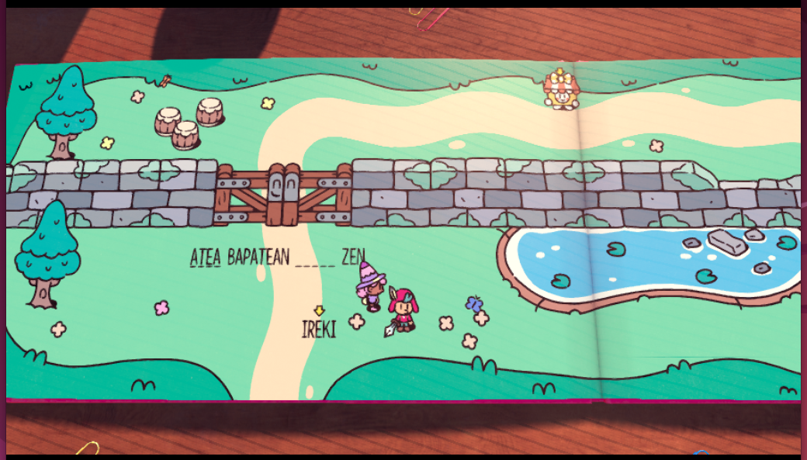

# Ezkutari Ausart euskalduna (The Plucky Squire euskaraz)

The Plucky Squire lehenengoz aurrerapen bideo batean ikusi nuen eta izugarri itxura izugarri polita hartu nion. Jokagarritasunak itxura ona zuen, misterio handirik gabekoa, baina batez ere itxura **polita** hartu nion. Pertsonaien diseinu minimalista, haurrentzako ipuin itxurako marrazkiak zoragarriak ziren.

Dena biltzen du ipuinen estetika horrek, izan ere, literalki ipuin bateko pertsonaiekin ipuinaren barruan arituko gara. Jokoan aitzinera egin ahala bertze dimentsio bat hartuko du horrek denak, baina hori jokoaren analisirako utziko dugu. Hau itzulpenaren albistea da eta ez dut gehiagorik kontatuko.

Trailerrarekin oraindik txundituta nintzelarik, analisiren batean ikusi nuen joko errazegia zela: puzzle sinpleak, borroka erraza, pista gehiegi... Jokalari anitz jokotik urrunduko lituzke iritzi horrek, baina nire kasuan, euskaratzeko joko hagitz egokia zela ikusi nuen. Izan ere, gure etxeko guztiok gozatzeko moduko jokoa da: mekanika sinpleak, (nahi izanez gero) pista argiak, estetikoki polita... haurrak beraiek bakarrik aritzeko gauza bakarra falta zaio: euskaraz egotea. Itzultzen hasiko ote nintzen pentsatzen ari nintzela, familiakide batek hauxe erran zuen: "Haurrak izanen nituzke, bakarrik joko honetan aritu daitezen.". Hala ba, erabakia hartua, ezin nuen aukera hau pasatzen utzi.

## Itzulpenean aurkitutako oztopoak

Orain arteko itzulpenetan gaztelera edota frantsesezko testuak aldatu izan ditut euskarazkoa sartzeko, jatorrizko hizkuntzaren aukera ikutu gabe utzi nahi izaten dudalako. Baina kasu honetan, ipuinean ikusten diren izenburuak (The Plucky Squire, El Escudero Valiente, Le Vaillant Petit Page) jokoaren enkriptatutako datuetan dauden irudi batzuk dira testu soilak izan beharrean. Horregatik ezin izan ditut izenburu horiek lokalizatu. Lokalizatu bi zentzutan: ezin izan ditut fitxategien artean aurkitu, eta ondorioz, ezin izan ditut itzuli. Horrela beraz, nahiago izan dut The Plucky Squire utzi eta audioak ingelesez aditzeko aukera izan euskarazko azpitituluekin.

Horretaz gain, jokoaren mekanika garrantzitsu bat esaldietako hitzak aldatzea da. Esaldia aldatuko dugu, nahi dugun esanahia emanez ipuina manipulatu ahal izateko. Hemen kosta zitzaidana izan zen hitz __bera__ bi esaldi desberdinetan ongi gelditu ahal izatea. Garatzaileek egin duten lana zoriontzeko modukoa iduritzen zait, sistema nahikoa flexiblea egin baitute hitz bat esaldi batean, esalditik kanpo edo bertze esaldi batean dagoenean aldaera desberdinak erabili ahal izateko (atzizkiak gehituz, adibidez) prestatu baitute. Horri esker azkenean nahiko gustora gelditu naiz emaitzarekin.

## Itzulpena instalatu

Ezkutari Ausartaren ipuina irakurri eta jostatu nahi baduzu, [hementxe](./readme.md) dituzu itzulpena instalatzeko eman beharreko pausuak. Erran bezala, jokoa itzultzerakoan oinarri bezala ingelesezko testuak hartu ditut. Itzulpena instalatu eta gero testuak ez badira euskaraz ageri, ezarpenetan hizkuntza aldatu eta 'English' aukeratu beharko da.

Beti bezala, probatu eta edozein akats edo hobekuntza ikusten baduzue, erran lasai.
