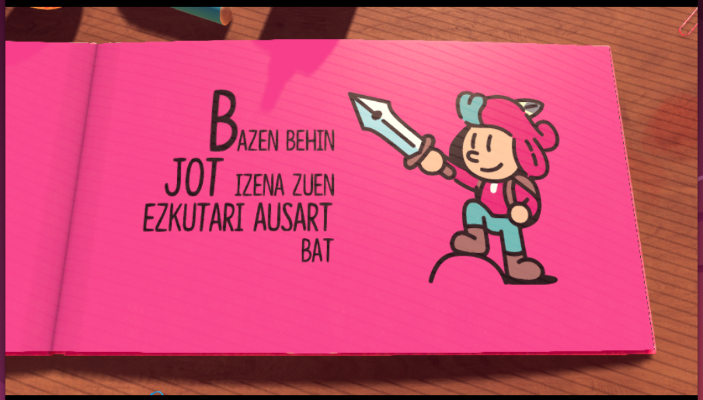

# EZKUTARI AUSARTA (THE PLUCKY SQUIRE euskaraz)

Dagokizun sistema eragileran exekutagarria deskargatu:

* [Linux](./instalatzailea/the_plucky_squire_linux), [Windows](./instalatzailea/the_plucky_squire.exe) edo MacOS ([M1](./instalatzailea/the_plucky_squire_macos_m1) eta [gainontzekoak](./instalatzailea/the_plucky_squire_macos))
* Exekutatu eta jokoaren instalazio direktorioa bilatuko du.
  * Aurkitzen badu, bertan instalatzeko proposatuko dizu.
  * Ez badu aurkitzen, zuk bilatzeko eskatuko dizu.
* Jokoa non instalatuta dagoen dakienean, programak itzulpena instalatuko du.

Instalazioa ongi joan bada, jokoko testuek euskaraz agertu behar lukete. Testuak ez badira euskaraz ageri, ezarpenetan hizkuntza aldatu eta 'English' aukeratu beharko da.

