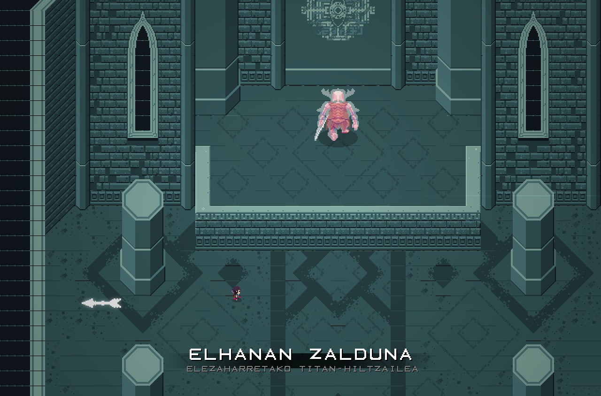
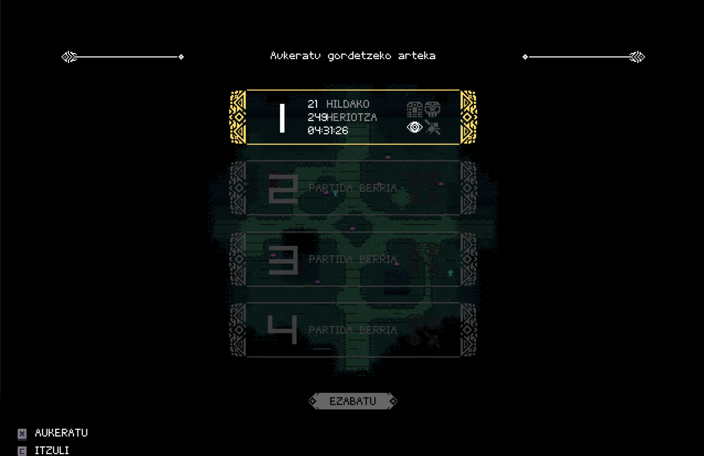

# Titanen Arimak (Titan Souls euskaraz)

Titan Souls-en partida berri bat hasi eta hasierako irudiei lagun egiteko soinu misteriotsu batzuk entzunen ditugu. Gizaki bat ageri da airean eta beregandik arkua eta gezi _bat_ urruntzen ari dira. Gizakitik bola hegalari xuri bat agertu eta hirutan banatuta, pantailan ikusten diren hiru objektuetan banatzen da, gizakian, arkuan eta gezi_a_n.

Hala ba, kitto, akabo jokoaren testuinguruaren aurkezpena. 2D mundu pixelatu zoragarri baten erdian agertuko gara. Ibiltzen hastea tokatzen da, herrialde zahar baten hondakinak diruditen leku bat esploratzen hasiko gara. Gezi_a_ botatzen, itzulipurdi egiten eta laster egiten ikasiko dugu hasierako korridore batzuetan mugituz. Hori bakarrik beharko dugu jokoaren mekanikak ezagutzeko.

Sarrera motz eta azalpen handirik gabea, mekanika gutti eta sinpleak (baina zuku handia atera beharko dizkiegunak), bakardadea... Joku honi minimalismoa dario, munduan zehar gabiltzala, ixiltasuna eta lasaitasuna nabari dira, musika lasaiak hortan ere laguntzen du.

https://youtu.be/a3etg8-D93s

## Nagusiak bakarrik

Lasai esploratu dezakegun puskatutako mundu bat da, zerbait gertatu da baina ez dakigu zer. Gure esplorazioan aurkituko ditugun ateetan sartuta musika lasaia moztuko duen tenstsio doinua hasiko da. Badakigu zerbait datorrela. Badakigu mundu hori puskatu izanaren arrazoien bat hurbil dagoela. Hor ikusiko dugu, gu baino dezente handiagoa den eta boteretsuagoa dirudien munstro bat, Titan bat!

Joko honetako gaiztoak horrelakoak dira, handiak eta boteretsuak. Nagusien kontra bakarrik arituko gara. Jokoaren garaitzaile diren Acid Nerveko kideek aipatu izan dute, Shadow of the Colossus-en demake bat dela. Izan ere, joko honetan ez dago bertzelako gaiztorik, ez dago esperientzia edo arma berriak lortzeko balio duten tarteko gaiztorik. Titanen bila joan behar dugu beraiek garaitu eta hurrengoaren bila joateko.

## Kolpe bakarra

Adi dagoen irakurlea ohartuko zen, nik ez baitut inongo pistarik eman, gezi _bat_ aipatu dudala. Hala da, bai, gezi bakarra dugu. Gezi hori bota eta berreskuratzeko bota dugun lekura joan beharko dugu. Edo ez. Izan ere, aukera interesgarri eta erabilgarriago bat ere badugu: gidatzen dugun gizakiak erakarpen indar magiko bat erabiltzen ahal du, urrun dagoen gezia bueltan ekartzeko.

Nagusien puntu ahula bilatu eta bertan egin behar diogu eraso. Asmatu ezkero, kolpe bakarrarekin hilko dugu (batzuk armadura antzeko bat dute, hori kendu beharko da lehenengo). Baina, adi, gu ere kolpe bakarrean hilko gaituzte. Hemen ez dago bizitza edo munizio neurgailurik. Gezi bat. Kolpe bat. Kitto. Baliteke lehenengo borrokan aurkitzea puntu ahul hori eta titana lehenengotik hiltzea, baina ez da ohikoena. Batzutan behin baino gehiagotan (dezente gehiagotan) hil beharko dugu nagusi horren puntu ahula zein izan daitekeen ohartzen hasteko.

## Zailtasuna

Jokoaren zailtasuna neurri onekoa iduritu zait. Nagusi bat hiltzen denean, bere inguruan metatzen den frustrazioa lehertu egiten da eta lortzen den saria izugarrizko pozarekin hartzen nuen. Jokoa, bere tentsio, haserre eta pozen balantzearekin, pila bat disfrutatu dudala izan da ondorioa.

Jokoa erronka polita izan da niretzat. 21 nagusi hiltzeko 249 aldiz hil naiz, hau da, nagusi bakoitzeko ia 12 aldiz hil naiz. Oroitzen dut baten bat bigarren edo hirugarren saiakeran hil nuela, beraz, bertzeren batean 12 aldi baino gehiagotan aritu behar izan dut. Nagusien inguruan beti dago checkpoint bat eta hil eta segituan agertuko gara bertan, beraz, heriotzak ez dira garestiegiak. Ez da nagusiarengana joateko bide luzerik egin behar edo partida berria berriz kargatzeko denbora luzez itxaron beharrik.

Bideojokoen munduan zailtasuna neurtzeko erabiltzen den unitatea 'souls' izaten da eta nola ez, joko hau leku batean baino gehiagotan modu horretan sailkatu dute. Nik ez dut souls bakar bat ere probatu (badakit, ez naiz True Gamer bat :-) ), eta ezin dut horrelako konparaziorik egin. Zuetako True Gamer baten bat animatzen bada, bota dezala bere iritzia.

## Istorioa

Erran bezala, hasieran ez digute gauza handirik kontatzen. Eta ez ezazuela pentsatu gerora ere azalpen gehiago dagoenik. Munduko hondakinetan bueltaka gabiltzala mural batzuk ikusiko ditugu, harrietan egindako marrazkiak, erraldoien baten gorpuzkinak... Eta elkarrizketa bakarra dago, baina nahiko abstraktua. Munduaren hondamendiaren edo gizakiaren iraganaren inguruko kontuan ezagutu nahi izanez gero, inbestigazio lana egitea tokatuko da.

Alde batetik irekia izatea ongi iduritzen zait, bakoitzak bere ondorioak atera ahal izateko. Baina bertzetik, nire gustorako irekiegia da eta ez dit inbestigatzen hasteko inongo hari puntarik uzten.

Hala ere, testu gutxi horiek euskaraz ikusteko aukera dugu eta horretarako pausoak [hemen](./readme.md) daude. Edozein akats aurkitzen baduzue edo proposamenik baduzue, erran lasai, denon artean hobetuko baitugu.